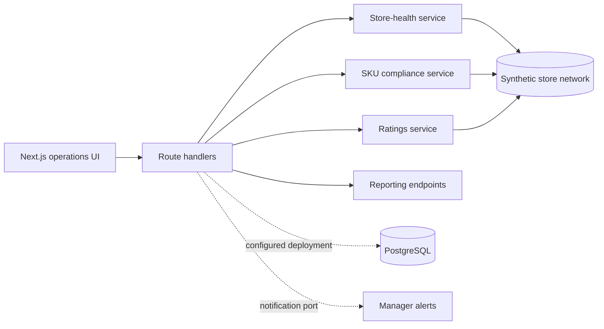

# Watchtower — multi-location retail operations

[](https://github.com/juanlopolicaarpio/retail-watchtower/actions/workflows/ci.yml)

Watchtower gives operations teams one place to monitor marketplace availability, store uptime, SKU compliance, customer ratings, and location performance across a distributed retail network.

> **Public release:** this system is based on operational monitoring software built for a real multi-location business. The company, locations, products, personnel, identifiers, and metrics in this repository are fictional. No production database, messaging account, or marketplace account is connected.

## What it demonstrates

- A multi-page operational command center built with Next.js, React, and TypeScript.
- Store-level monitoring across two marketplace channels with normalized health states.
- SKU availability workflows that identify stock gaps and prepare manager escalations.
- Ratings history, trend analysis, and a combined performance leaderboard.
- CSV-ready reporting routes for uptime, ratings, and availability analysis.
- A typed PostgreSQL/Drizzle data model with a zero-credential synthetic runtime.

## Product surfaces

| Surface | Operational question |
|---|---|
| Executive overview | How healthy is the store network right now? |
| Store monitor | Which locations are offline, blocked, or slow? |
| SKU availability | Where are products unavailable and who needs to act? |
| Ratings | Which locations are improving or declining? |
| Store rankings | Which locations lead on uptime and availability? |

## Architecture



Without `DATABASE_URL`, every screen and report uses the bundled synthetic dataset. Alert actions simulate the escalation contract and never send messages. A configured deployment can replace those boundaries with persistence and approved notification providers.

See [the architecture notes](docs/ARCHITECTURE.md).

## Run locally

```bash
npm ci
npm run dev
```

Open `http://localhost:3000`. No account, database, or API key is required.

## Quality gates

```bash
npm run lint
npm run typecheck
npm run build
# or all three
npm run check
```

## Repository map

```text
src/app/             dashboards and server routes
src/components/      navigation and reporting controls
src/lib/demo-data.ts fictional store-network data
src/lib/schema.ts    relational monitoring model
src/lib/db.ts        optional PostgreSQL adapter
docs/                architecture decisions
```

## Confidentiality

The public release excludes the original organization name, store mappings, manager contacts, phone numbers, database credentials, marketplace identifiers, source exports, and operational history. Juniper Eats is fictional.

## Author

Built by [Juanlo Policarpio](https://github.com/juanlopolicaarpio).

Copyright © 2026 Juanlo Policarpio. All rights reserved. See [LICENSE](LICENSE).
