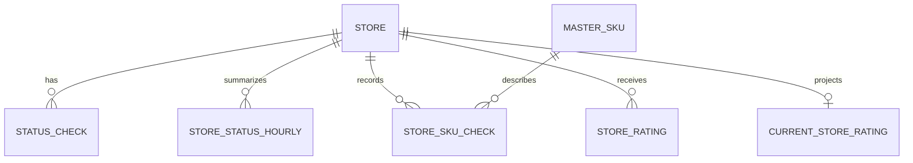

# Architecture

## Operating model

Watchtower treats each marketplace listing as an observable endpoint. Health, availability, and rating observations are normalized into a common store identity and then aggregated for operational decisions.

```text
observe → normalize → detect → prioritize → escalate → verify
```

## Runtime modes

The default runtime is intentionally complete without infrastructure:

- Route handlers return typed synthetic store, SKU, and ratings observations.
- Report endpoints transform the same synthetic source into export-ready rows.
- Escalation endpoints validate the request and return a simulation result.
- No external request is issued.

When `DATABASE_URL` is configured, route handlers use Drizzle queries against the relational monitoring schema. Notification delivery remains an edge adapter and should be connected only after provider-specific authentication, rate limits, audit logging, and approval rules are configured.

## Data model



The hourly tables separate raw observations from reporting queries, making uptime windows and fleet summaries cheaper to calculate. Current-rating data is projected separately from history so the dashboard does not need to repeatedly scan the event log.

## Reliability decisions

- Health states distinguish `ONLINE`, `OFFLINE`, `BLOCKED`, `ERROR`, and `UNKNOWN` rather than collapsing every failed probe into downtime.
- Confidence is carried with probe status so automated checks can be reviewed rather than treated as unquestionable truth.
- Server-side caching controls repeated dashboard queries without moving business logic into the browser.
- Alert actions are explicit user operations; the public release simulates them and performs no outbound messaging.
